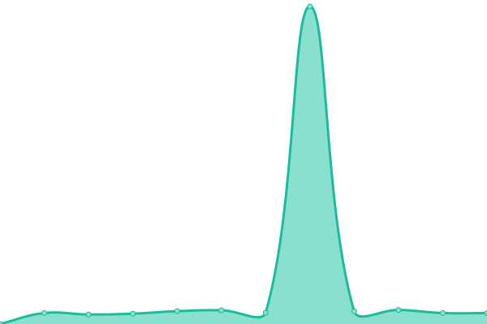

# [📈 Live Status](https://status.libreturks.dev): <!--live status--> **🟥 Complete outage**

This repository contains the open-source uptime monitor and status page for [LibreTurks](https://libreturks.dev), powered by [Upptime](https://github.com/upptime/upptime).

With [Upptime](https://upptime.js.org), you can get your own unlimited and free uptime monitor and status page, powered entirely by a GitHub repository. We use [Issues](https://github.com/LibreTurks/manifests2/issues) as incident reports, [Actions](https://github.com/LibreTurks/manifests2/actions) as uptime monitors, and [Pages](https://status.libreturks.dev) for the status page.

<!--start: status pages-->
<!-- This summary is generated by Upptime (https://github.com/upptime/upptime) -->
<!-- Do not edit this manually, your changes will be overwritten -->
<!-- prettier-ignore -->
| URL | Status | History | Response Time | Uptime |
| --- | ------ | ------- | ------------- | ------ |
|  [libreturks.dev](https://libreturks.dev) | 🟥 Down | [libreturks-dev.yml](https://github.com/LibreTurks/status.libreturks.dev/commits/HEAD/history/libreturks-dev.yml) | 

 1866ms
     
 | 

<a href="https://status.libreturks.dev/history/libreturks-dev">80.17%</a>
    

|  [libreturks.dev - main node](https://main.libreturks.dev) | 🟥 Down | [libreturks-dev-main-node.yml](https://github.com/LibreTurks/status.libreturks.dev/commits/HEAD/history/libreturks-dev-main-node.yml) | 

 1760ms
     
 | 

<a href="https://status.libreturks.dev/history/libreturks-dev-main-node">81.35%</a>
    

|  [miniflux](https://rss.libreturks.dev) | 🟥 Down | [miniflux.yml](https://github.com/LibreTurks/status.libreturks.dev/commits/HEAD/history/miniflux.yml) | 

 1638ms
     
 | 

<a href="https://status.libreturks.dev/history/miniflux">81.07%</a>
    

|  [keycloak](https://auth.libreturks.dev) | 🟥 Down | [keycloak.yml](https://github.com/LibreTurks/status.libreturks.dev/commits/HEAD/history/keycloak.yml) | 

 1279ms
     
 | 

<a href="https://status.libreturks.dev/history/keycloak">79.22%</a>
    

|  [redmine](https://redmine.libreturks.dev) | 🟥 Down | [redmine.yml](https://github.com/LibreTurks/status.libreturks.dev/commits/HEAD/history/redmine.yml) | 

 1235ms
     
 | 

<a href="https://status.libreturks.dev/history/redmine">78.84%</a>
    

<!--end: status pages-->

[**Visit our status website →**](https://status.libreturks.dev)

## 📄 License

- Powered by: [Upptime](https://github.com/upptime/upptime)
- Code: [MIT](./LICENSE) © [Anand Chowdhary](https://anandchowdhary.com), supported by [Pabio](https://pabio.com)
- Data in the `./history` directory: [Open Database License](https://opendatacommons.org/licenses/odbl/1-0/)
